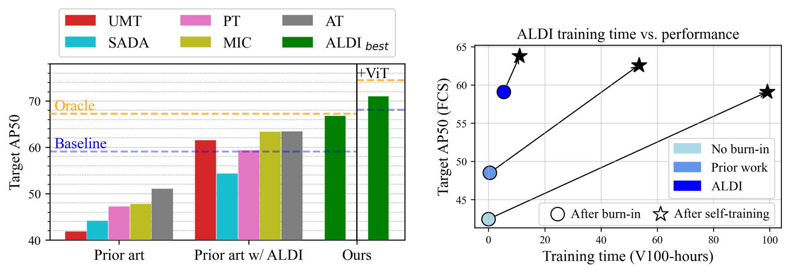

# Align and Distill (ALDI): A Unified Framework for Domain Adaptive Object Detection

This is the official codebase for [Align and Distill: A Unified Framework for Domain Adaptive Object Detection]().



Align and Distill ($ALDI$) is a state-of-the-art framework for domain adaptive object detection (DAOD), built on top of the [Detectron2](https://github.com/facebookresearch/detectron2/) object detection library. $ALDI$ is:

- **Accurate:** $ALDI$'s default settings achieve <ins>state-of-the-art results</ins> on DAOD benchmarks including Cityscapes &rarr; Foggy Cityscapes, Sim10k &rarr; Cityscapes, and CFC Kenai &rarr; Channel.

- **Fast to train:** Thanks to efficient dataloading and optimized burn-in settings, $ALDI$ <ins>trains upwards of 20x faster</ins> than other DAOD methods.
 
- **Easy to use:** Training DAOD models on your own data requires just a couple steps; see [setting up your own data](docs/CUSTOM_DATA.md) and [training ALDI](docs/TRAINING.md).
- **Extensible:** The framework is lightweight, reusing default components from Detectron2 wherever possible. See [code documentation](docs/CODEBASE.md) for an overview of the code structure and design decisions.

## Installation

See [installation instructions](docs/INSTALL.md).

## Model zoo

We provide burn-in checkpoints and final models for $ALDI_{best}$ for DAOD benchmarks (Cityscapes &rarr; Foggy Cityscapes, Sim10k &rarr; Cityscapes, and CFC Kenai &rarr; Channel) in [the model zoo](docs/MODELS.md).

For compatibility with existing config files, download models to the `models/` directory in this repo.

You can also download all models using `models/download_models.sh`

## Benchmark dataset setup

Follow [these instructions](docs/DATASETS.md) to set up data and reproduce benchmark results on Cityscapes &rarr; Foggy Cityscapes, Sim10k &rarr; Cityscapes, and CFC Kenai &rarr; Channel.

## <a id="own-data"></a>Using your own data 

To use $ALDI$ on your own data, see [instructions for custom datasets](docs/CUSTOM_DATA.md).

## Training ALDI

See [training instructions](docs/TRAINING.md).

## Extras

The [main](/justinkay/aldi/tree/main) branch contains all you need to run $ALDI$, and is a good starting point for most.

Additional code and configuration files to reproduce all experiments in [our paper]() can be found on the [extras](/justinkay/aldi/tree/extras) branch.

## Reference

#### [Align and Distill: A Unified Framework for Domain Adaptive Object Detection]()

[Justin Kay](https://justinkay.github.io), [Timm Haucke](https://timm.haucke.xyz/), [Suzanne Stathatos](https://suzanne-stathatos.github.io/), [Siqi Deng](https://www.amazon.science/author/siqi-deng), [Erik Young](https://home.tu.org/users/erikyoung), [Pietro Perona](https://scholar.google.com/citations?user=j29kMCwAAAAJ), [Sara Beery](https://beerys.github.io/), and [Grant Van Horn](https://gvanhorn38.github.io/).

Domain adaptive object detection (DAOD) seeks to address performance degradation caused by distribution shift between training and test data.
Prior work claims that DAOD methods can more than double the performance of baseline models. We identify two key shortcomings in these works that call the validity of these claims into question: (1) Baselines and oracles are under-powered and often out of date, with limited study of DAOD for modern architectures, 
and (2) Methods are built on top of inconsistent object detection frameworks, making it difficult to directly compare their performance. We propose *Align and Distill (ALDI)*: a unified framework for DAOD allowing for fair evaluation within a single state-of-the-art object detection codebase. Additionally, common DAOD benchmarks focus almost entirely on urban street settings.
We contribute a novel DAOD benchmark dataset sourced from a real-world domain adaptation challenge in environmental monitoring, increasing the diversity of DAOD application domains.
Our framework and dataset enable us to systematically investigate the contribution of different DAOD components and propose novel training techniques leading to state-of-the-art performance across diverse applications. 

If you find our work useful in your research please consider citing our paper:

```
@inproceedings{TODO,
    author    = {Kay, Justin and Haucke, Timm and Stathatos, Suzanne and Deng, Siqi and Young, Erik and Perona, Pietro and Beery, Sara and Van Horn, Grant},
    title     = {Align and Distill: A Unified Framework for Domain Adaptive Object Detection},
    booktitle = {TODO},
    year      = {2024}
}
```
