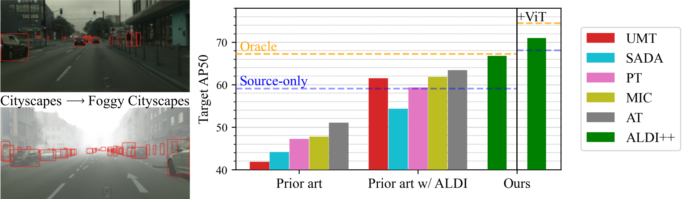

# Align and Distill (ALDI): A Unified Framework for Domain Adaptive Object Detection

This is the official codebase for [Align and Distill: Unifying and Improving Domain Adaptive Object Detection]().

Align and Distill (ALDI) is a state-of-the-art framework for domain adaptive object detection (DAOD), built on top of the [Detectron2](https://github.com/facebookresearch/detectron2/) object detection library. ALDI is:

**Accurate:** ALDI's default settings achieve <ins>state-of-the-art results</ins> on DAOD benchmarks including Cityscapes &rarr; Foggy Cityscapes, Sim10k &rarr; Cityscapes, and CFC Kenai &rarr; Channel.

**Fast to train:** Thanks to efficient dataloading and optimized burn-in settings, ALDI <ins>trains upwards of 20x faster</ins> than other DAOD methods.
 
**Easy to use:** Training DAOD models on your own data requires just a couple steps; see [setting up your own data](docs/CUSTOM_DATA.md) and [training ALDI](docs/TRAINING.md).

**Extensible:** The framework is lightweight, reusing default components from Detectron2 wherever possible. See [code documentation](docs/CODEBASE.md) for an overview of the code structure and design decisions.

## Installation

See [installation instructions](docs/INSTALL.md).

## Model zoo

We provide burn-in checkpoints and final models for DAOD benchmarks (Cityscapes &rarr; Foggy Cityscapes, Sim10k &rarr; Cityscapes, and CFC Kenai &rarr; Channel) in [the model zoo](docs/MODELS.md).

For compatibility with existing config files, download models to the `models/` directory in this repo.

You can also download all models using `models/download_models.sh`

## Benchmark dataset setup

Follow [these instructions](docs/DATASETS.md) to set up data and reproduce benchmark results on Cityscapes &rarr; Foggy Cityscapes, Sim10k &rarr; Cityscapes, and CFC Kenai &rarr; Channel.

## Using your own data 

To use ALDI on your own data, see [instructions for custom datasets](docs/CUSTOM_DATA.md).

## Training ALDI

See [training instructions](docs/TRAINING.md).
