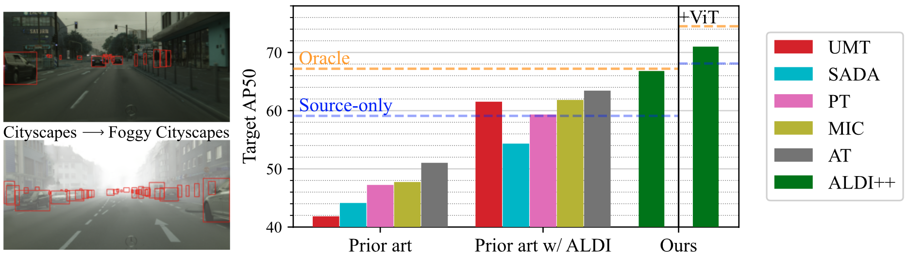

# <div align="center"> Align and Distill: Unifying and Improving <br>Domain Adaptive Object Detection</div>

<div align="center">
 
Official codebase for [Align and Distill: Unifying and Improving Domain Adaptive Object Detection](https://arxiv.org/abs/2403.12029).

\[[Project Page](https://aldi-daod.github.io/)\] \[[Arxiv](https://arxiv.org/abs/2403.12029)\] \[[PDF](https://arxiv.org/pdf/2403.12029.pdf)\] 

[](https://paperswithcode.com/sota/unsupervised-domain-adaptation-on-cityscapes-1?p=align-and-distill-unifying-and-improving) [](https://paperswithcode.com/sota/unsupervised-domain-adaptation-on-sim10k-to-3?p=align-and-distill-unifying-and-improving) [](https://paperswithcode.com/sota/unsupervised-domain-adaptation-on-cfc-daod?p=align-and-distill-unifying-and-improving)



</div>

## Documentation

Align and Distill (ALDI) is a framework for domain adaptive object detection that is state-of-the-art, fast to train, and easy to extend. 

ALDI is built on top of the [Detectron2](https://github.com/facebookresearch/detectron2/) object detection library and follows the same design patterns where possible. In particular, training settings are managed by [config files](configs), datasets are managed by a [dataset registry](aldi/datasets.py), training is handled by a custom [`Trainer`]() class that extends [`DefaultTrainer`](), and we provide a training script in [tools/train_net.py](tools/train_net.py) that comes with [all the same functionality](https://detectron2.readthedocs.io/en/latest/tutorials/getting_started.html) as the Detectron2 script by the same name.

<details open>
<summary><h3>Install</h3></summary>

Pip install the `aldi` package including all [requirements]() in a **Python>=3.8** environment with [**PyTorch>=1.8**](https://pytorch.org/get-started/locally/).

```bash
pip install aldi
```

To instead install from source see these [instructions](docs/INSTALL.md).
</details>


<details open>
<summary><h3>Data setup</h3></summary>

**Custom data:** The easiest way to use your own dataset is to create a [COCO-formatted JSON file](https://docs.aws.amazon.com/rekognition/latest/customlabels-dg/md-coco-overview.html) and [register your dataset with Detectron2](https://detectron2.readthedocs.io/en/latest/tutorials/datasets.html#register-a-coco-format-dataset):

```python
# add this to the top of tools/train_net.py (or aldi/datasets.py if you installed from source)
from detectron2.data.datasets import register_coco_instances
register_coco_instances("your_dataset_name", {}, "path/to/your_coco_labels.json", "path/to/your/images/")
```

Because ALDI is designed for unsupervised domain adaptation, you will likely register multiple "datasets":

- Train: Labeled source-domain images for supervised burn-in and training
- Unlabeled: Target-domain images for DAOD. These can be optionally labeled if you also want to use them to train a supervised "oracle" for comparison. If unlabeled, the `"annotations"` entry of your COCO file can be an empty list.
- Test: A labeled validation set. In most DAOD papers this comes from your target domain, even though this breaks the constraints of UDA.

Note that by default Detectron2 assumes all paths are relative to `./datasets` relative to your current working directory. You can change this location if desired using the `DETECTRON2_DATASETS` environment variable, e.g.: `export DETECTRON2_DATASETS=/path/to/datasets`.

**DAOD benchmarks:** Follow [these instructions](docs/DATASETS.md) to set up data and reproduce benchmark results on the datasets in [our paper](https://arxiv.org/abs/2403.12029): Cityscapes &rarr; Foggy Cityscapes, Sim10k &rarr; Cityscapes, and CFC Kenai &rarr; Channel.

</details>


<details open>
<summary><h3>Config setup</h3></summary>

Training is managed through [config files](configs/). We provide example configs for burn-in/baseline models, oracle models, and ALDI++.

TODO

```
DATASETS:
  TRAIN: ("your_training_dataset_name",) # needs to be a tuple, and can contain multiple datasets if you want
  UNLABELED: ("your_unlabeled_dataset_name",) # needs to be a tuple, and can contain multiple datasets if you want
  TEST: ("your_test_dataset_name",)  # needs to be a tuple, and can contain multiple datasets if you want
```

```
MODEL:
  ROI_HEADS:
    NUM_CLASSES: 9 # change to match your number of classes
```

</details>

<details open>
<summary><h3>Training</h3></summary>

TODO

</details>


<details open>
<summary><h3>Evaluation</h3></summary>

TODO

</details>

## Model zoo

We provide burn-in checkpoints and final models for DAOD benchmarks (Cityscapes &rarr; Foggy Cityscapes, Sim10k &rarr; Cityscapes, and CFC Kenai &rarr; Channel) in [the model zoo](docs/MODELS.md).

For compatibility with existing config files, download models to the `models/` directory in this repo.

You can download the required model weights for any config file we provide using `python tools/download_model_for_config.py --config-file path/to/config.yaml`

## Extras

The [main](/justinkay/aldi/tree/main) branch contains all you need to run ALDI, and is a good starting point for most.

Additional code and configuration files to reproduce all experiments in [our paper](https://arxiv.org/abs/2403.12029) can be found on the [extras](/justinkay/aldi/tree/extras) branch.

## Reference

#### [Align and Distill: Unifying and Improving Domain Adaptive Object Detection](https://arxiv.org/abs/2403.12029)

[Justin Kay](https://justinkay.github.io), [Timm Haucke](https://timm.haucke.xyz/), [Suzanne Stathatos](https://suzanne-stathatos.github.io/), [Siqi Deng](https://www.amazon.science/author/siqi-deng), [Erik Young](https://home.tu.org/users/erikyoung), [Pietro Perona](https://scholar.google.com/citations?user=j29kMCwAAAAJ), [Sara Beery](https://beerys.github.io/), and [Grant Van Horn](https://gvanhorn38.github.io/).

Object detectors often perform poorly on data that differs from their training set. Domain adaptive object detection (DAOD) methods have recently demonstrated strong results on addressing this challenge. Unfortunately, we identify systemic benchmarking pitfalls that call past results into question and hamper further progress: (a) Overestimation of performance due to underpowered baselines, (b) Inconsistent implementation practices preventing transparent comparisons of methods, and (c) Lack of generality due to outdated backbones and lack of diversity in benchmarks. We address these problems by introducing: (1) A unified benchmarking and implementation framework, Align and Distill (ALDI), enabling comparison of DAOD methods and supporting future development, (2) A fair and modern training and evaluation protocol for DAOD that addresses benchmarking pitfalls, (3) A new DAOD benchmark dataset, CFC-DAOD, enabling evaluation on diverse real-world data, and (4) A new method, ALDI++, that achieves state-of-the-art results by a large margin. ALDI++ outperforms the previous state-of-the-art by +3.5 AP50 on Cityscapes → Foggy Cityscapes, +5.7 AP50 on Sim10k → Cityscapes (where ours is the only method to outperform a fair baseline), and +2.0 AP50 on CFC Kenai → Channel. Our framework, dataset, and state-of-the-art method offer a critical reset for DAOD and provide a strong foundation for future research. 

If you find our work useful in your research please consider citing our paper:

```
@misc{kay2024align,
      title={Align and Distill: Unifying and Improving Domain Adaptive Object Detection}, 
      author={Justin Kay and Timm Haucke and Suzanne Stathatos and Siqi Deng and Erik Young and Pietro Perona and Sara Beery and Grant Van Horn},
      year={2024},
      eprint={2403.12029},
      archivePrefix={arXiv},
      primaryClass={cs.CV}
}
```
